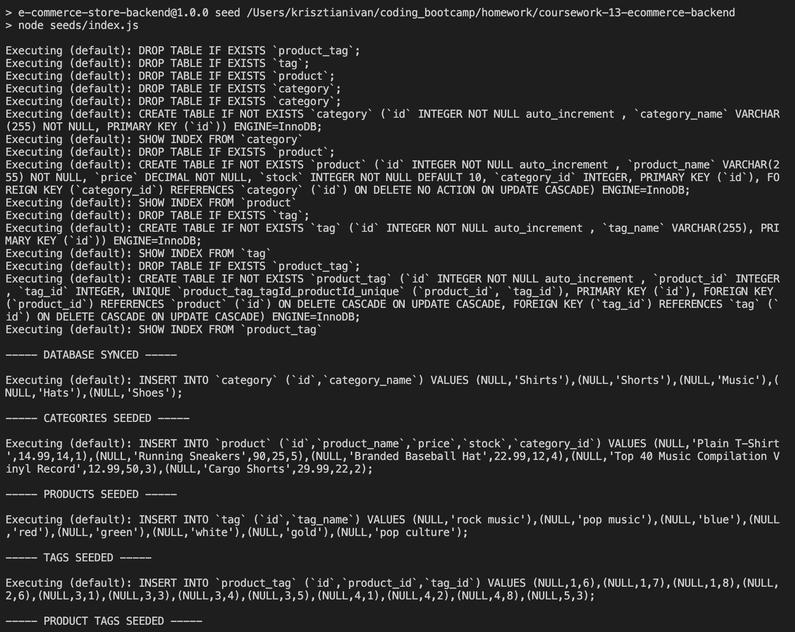
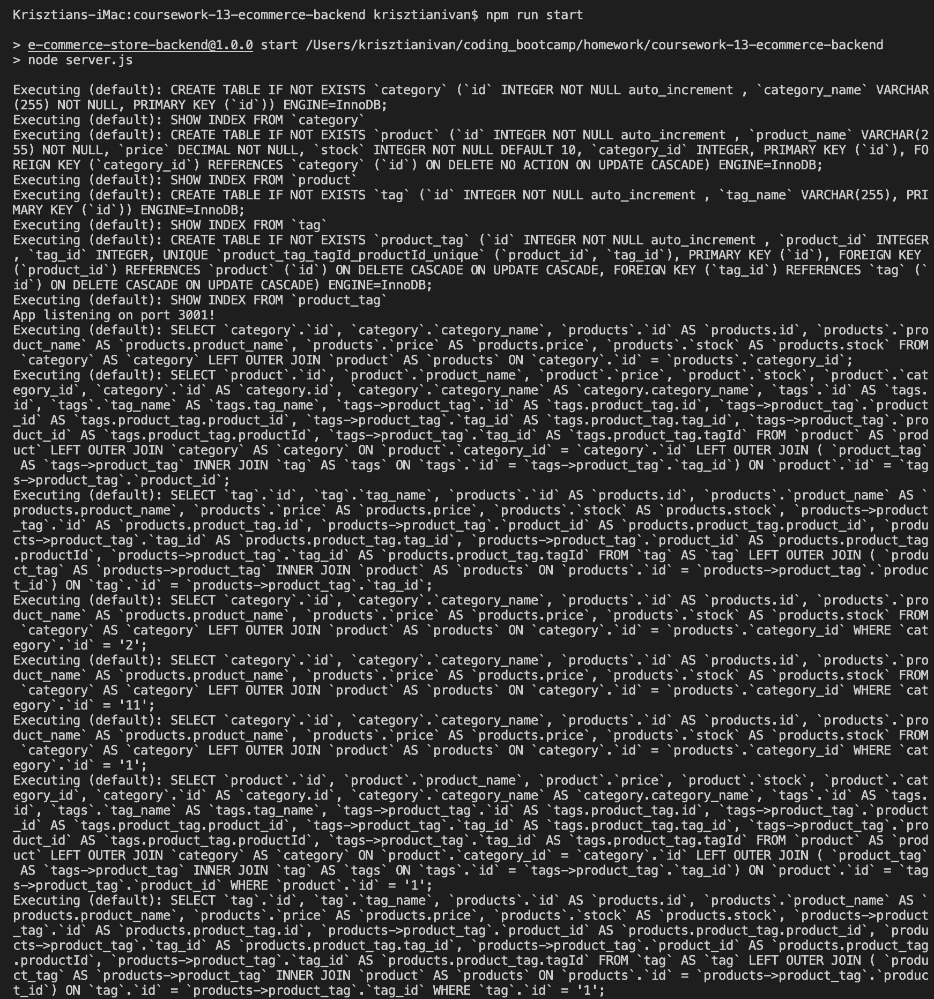
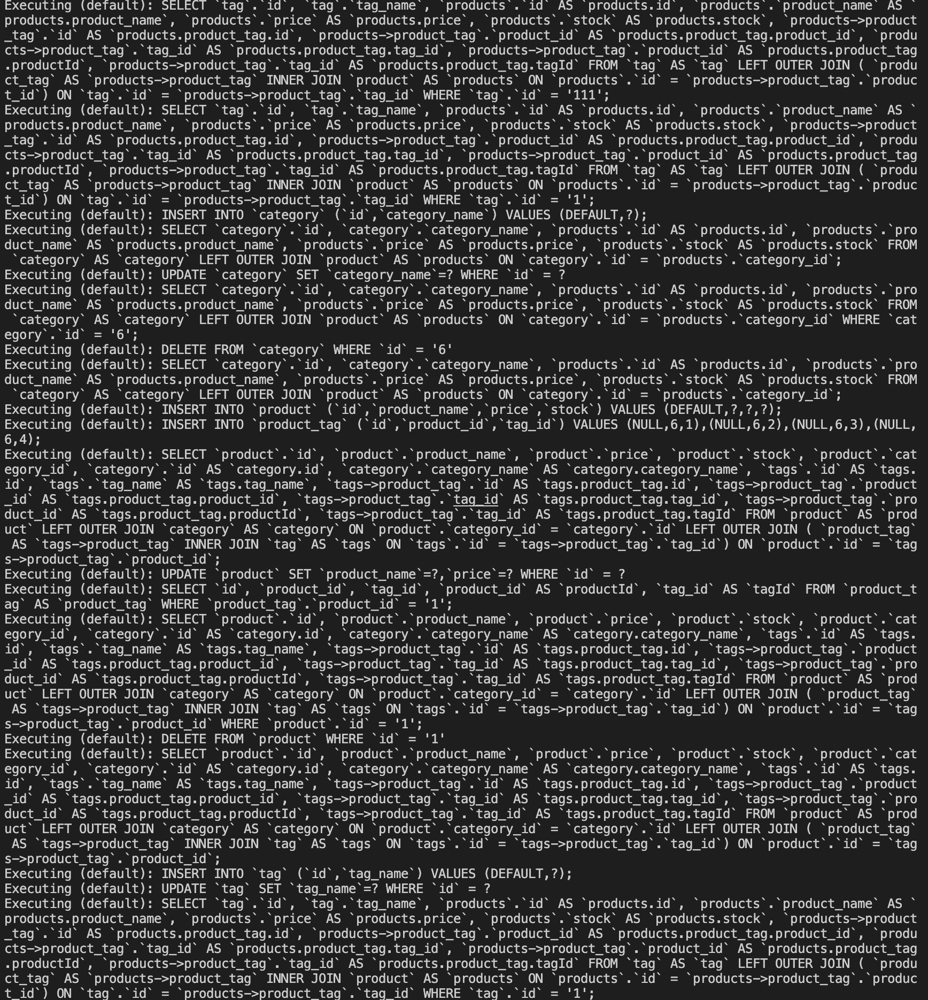
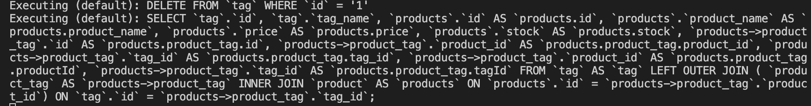
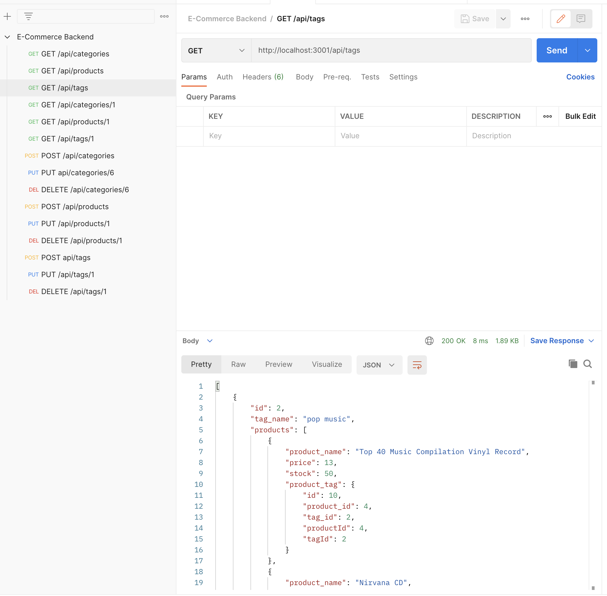

# E-commerce Store Backend

## Description

In this project I have created the backend for an e-commerce store using the Sequelize package to create database table Models and RESTful API routes. I also used the dotenv package to protect sensitive information such as username and password to the database.

## What I have done

- [x] Created table Models for Category, Product, ProductTag and Tag using the sequelize package
- [x] Added association methods for interactions between the database tables
- [x] Created RESTful API routes to Get, Post, Put and Delete data using the related API routes and requests
- [x] Synced the database with the server using the sequelize package
- [x] Created a Postman collection with the different API routes to allow testing of functionality

## Installation

```
git clone https://github.com/ivnkris/e-commerce-store-backend.git
cd employee-management-cms-tool
npm install
```

## Getting Started

- Create the database in mySQL Workbench using the db/schema.sql file
- Create a .env file using the .env.EXAMPLE to allow connection to the database
- Seed the database with test data running the `npm run seed` script
- Run `npm run start` to start the server
- Import the postman collection located in utils/e-commerce-backend.postman_collection.json to test API routes

## Contributing

Submit a pull request

## Scripts

```
npm run seed
npm run start
npm run watch
```

## Link to GitHub repository

https://github.com/ivnkris/e-commerce-store-backend

## Link to walkthrough video

https://drive.google.com/file/d/1HlzRQXfgIAl2WgYKlzC3Zb2isNKFhHaQ/view

## Screenshots







## Questions

- Send any questions via my [GitHub profile](https://github.com/ivnkris)
